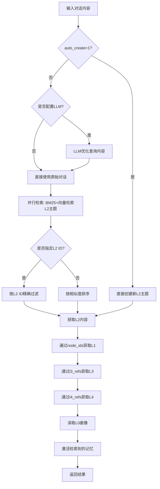
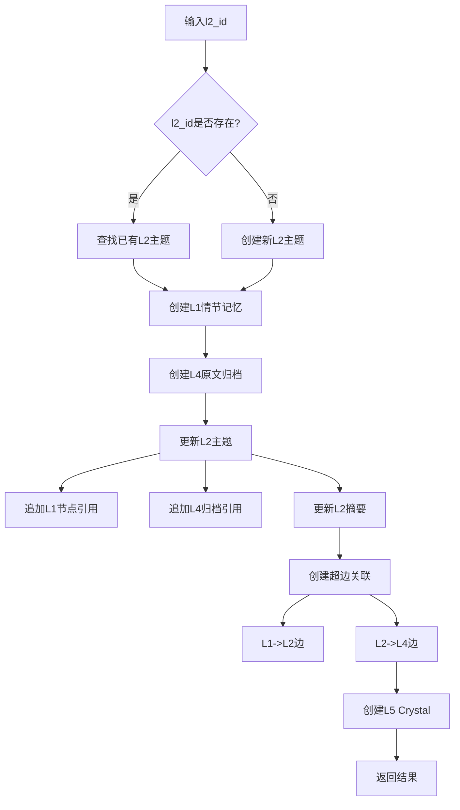
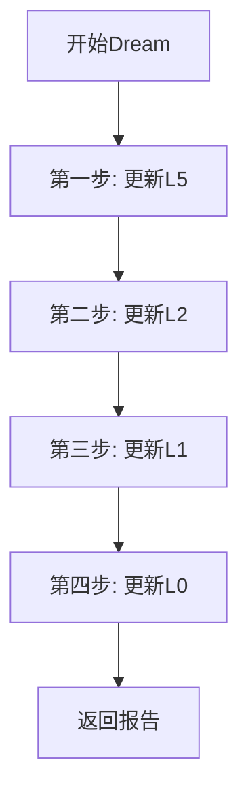

# MemHop 新版 API 设计文档

本文档基于MemHop六层认知架构（L0-L5），设计四个核心业务接口，用于AI Agent的记忆管理。

---

## 目录

- [接口1：创建/打开数据库](#接口1创建打开数据库)
- [接口2：检索记忆](#接口2检索记忆)
- [接口3：更新记忆](#接口3更新记忆)
- [接口4：Dream整合](#接口4dream整合)
- [接口5：查询L0画像](#接口5查询l0画像)
- [接口6：查询L1情节记忆](#接口6查询l1情节记忆)
- [接口7：查询L2主题列表](#接口7查询l2主题列表)
- [接口8：查询L2主题详情](#接口8查询l2主题详情)
- [接口9：查询L3知识域列表](#接口9查询l3知识域列表)
- [接口10：查询L3知识域详情](#接口10查询l3知识域详情)
- [接口11：查询L4归档内容](#接口11查询l4归档内容)
- [接口12：查询L5技能列表](#接口12查询l5技能列表)
- [接口13：修改L0画像](#接口13修改l0画像)
- [接口14：修改L2标题](#接口14修改l2标题)
- [接口15：修改L3标题](#接口15修改l3标题)
- [接口16：修改L5标题](#接口16修改l5标题)
- [接口18：合并L2主题](#接口18合并l2主题)
- [接口19：导入记忆](#接口19导入记忆)
- [接口17：关闭数据库](#接口17关闭数据库)

---

## 接口1：创建/打开数据库

### 功能说明

创建或打开一个MemHop数据库实例，初始化内存映射和索引结构。

### 接口签名

```rust
pub fn open(config: MemHopConfig) -> Result<MemHop>
```

### 参数说明

| 参数 | 类型 | 必需 | 描述 |
|------|------|------|------|
| `db_path` | `PathBuf` | 是 | 数据库文件路径（包含文件名，如 `./data/agent.meh`） |
| `encoder_socket` | `PathBuf` | 是 | 向量模型Unix套接字路径（默认: `/tmp/memhop_encoder.sock`） |
| `vector_dim` | `usize` | 是 | 向量维度（创建时确定，不可更改，如768、1024、1536） |
| `crystal_path` | `PathBuf` | 否 | 结晶化知识存储路径（默认: 与db_path同目录） |

### 请求示例

```rust
use memhop::{MemHop, MemHopConfig};
use std::path::PathBuf;

// 基本配置
let config = MemHopConfig {
    db_path: PathBuf::from("./data/agent.meh"),
    encoder_socket: PathBuf::from("/tmp/custom_encoder.sock"),
    vector_dim: 1024,
    crystal_path: None,  // 使用默认路径
};
let mut db = MemHop::open(config)?;

// 自定义结晶路径
let config = MemHopConfig {
    db_path: PathBuf::from("./data/agent.meh"),
    encoder_socket: PathBuf::from("/tmp/custom_encoder.sock"),
    vector_dim: 1024,
    crystal_path: Some(PathBuf::from("./crystals/agent_crystals")),
};
let mut db = MemHop::open(config)?;
```

### 返回示例

```rust
// 成功返回MemHop实例
MemHop {
    mmap: MmapMut,
    file: File,
    header: FileHeader,
    config: MemHopConfig,
    btree: BTreeIndex,
    sparse_index: SparseIndex,
    activation_manager: ActivationManager,
    session_manager: SessionManager,
    encoder: None,
}

// 失败返回错误
Err(MemHopError::Io(io::Error))
Err(MemHopError::InvalidMagic)
Err(MemHopError::InvalidVersion { expected: 30, actual: 0 })
```

---

## 接口2：检索记忆

### 功能说明

根据对话内容和可选的层级ID，检索相关记忆，返回L0-L4层级内容，并激活检索到的记忆。支持LLM优先优化查询内容，并行检索L2主题和L3知识域。当`auto_create=1`时，跳过检索流程，直接创建新的L2主题。

### 接口签名

```rust
pub fn search_memory(&mut self, query: SearchQuery) -> SearchResult
```

### 参数说明

| 参数 | 类型 | 必需 | 默认值 | 描述 |
|------|------|------|--------|------|
| `dialogue` | `String` | 是 | - | 当前对话内容（用于BM25+向量检索） |
| `l2_id` | `Option<String>` | 否 | `None` | L2主题唯一标识（精确匹配） |
| `l3_id` | `Option<String>` | 否 | `None` | L3知识域唯一标识（精确匹配） |
| `l2_limit` | `usize` | 否 | `10` | 返回L2主题数量上限 |
| `l3_limit` | `usize` | 否 | `10` | 返回L3知识数量上限 |
| `llm_enhance` | `Option<LlmConfig>` | 否 | `None` | LLM增强配置（可选，用于优化检索查询） |
| `auto_create` | `u8` | 否 | `0` | 是否自动新建L2（0:检索模式, 1:直接创建模式） |

### 返回结构

```rust
pub struct SearchResult {
    /// 检索到的记忆ID列表（用于后续更新）
    pub memory_ids: Vec<String>,
    
    /// L0 - Agent画像
    pub l0_profile: Option<L0Profile>,
    
    /// L2 - 语义主题列表
    pub l2_topics: Vec<L2TopicResult>,
    
    /// L3 - 知识域列表
    pub l3_knowledge: Vec<L3KnowledgeResult>,
    
    /// 通过L1关联的L2内容（相似度阈值过滤）
    pub l1_associated_l2: Vec<L2TopicResult>,
    
    /// L4 - 原文归档（与L2对应）
    pub l4_archives: Vec<L4ArchiveResult>,
}

pub struct L0Profile {
    pub id: String,
    pub name: String,
    pub role: String,
    pub personality: String,
    pub worldview: String,
}

pub struct L2TopicResult {
    pub id: String,
    pub title: String,
    pub summary: Option<String>,
    pub activation_score: f32,
    pub l1_count: usize,
    pub l3_refs: Vec<String>,
    pub l4_refs: Vec<String>,
}

pub struct L3KnowledgeResult {
    pub id: String,
    pub title: String,
    pub domain: String,
    pub text: String,
    pub knowledge_type: String,
    pub confidence: f32,
}

pub struct L4ArchiveResult {
    pub id: String,
    pub topic_id: String,
    pub content: String,
    pub timestamp: i64,
}
```

### 检索流程

**L2中心化扇出检索模型**：

```
L2 (主要检索目标)
├── L1 (通过node_ids关联)
├── L3 (通过l3_refs关联)
└── L4 (通过l4_refs关联)
```

**检索流程说明**：

**模式1：直接创建模式（auto_create=1）**
1. 跳过检索流程，直接根据`dialogue`内容创建新的L2主题
2. 返回新创建的L2主题及其关联数据

**模式2：检索模式（auto_create=0，默认）**
1. **LLM优先优化**：如果配置了`llm_enhance`，优先使用LLM对当轮对话内容进行优化，提取关键词、扩展同义词、理解用户意图
2. **并行检索**：同时启动向量模型和BM25检索，检索L2所有跟节点摘要以及第二层节点摘要（L2支持3层节点），以及同L1关联到的其他L2内容（只关联到主节点）
   - **向量检索**：使用向量相似度匹配L2主题的centroid_vector
   - **BM25检索**：使用稀疏索引匹配L2主题的标题和摘要
   - **结果融合**：将两种检索结果按RRF（Reciprocal Rank Fusion）算法融合排序
3. **L2过滤**：如果指定了`l2_id`，按L2 ID精确过滤；否则按相似度排序
4. **L3过滤**：如果指定了`l3_id`，按L3 ID精确过滤
5. **层级扇出**：通过L2的node_ids获取L1，通过l3_refs获取L3，通过l4_refs获取L4
6. **激活记忆**：检索到的记忆自动激活，用于后续检索优先级提升



### 请求示例

```rust
use memhop::query::search::SearchQuery;

let query = SearchQuery {
    dialogue: "我想学习Rust编程语言".to_string(),
    l2_id: None,                    // 不指定L2主题
    l3_id: Some("knowledge_001".to_string()), // 指定L3知识域ID
    l2_limit: 10,
    l3_limit: 10,
    llm_enhance: None,
    auto_create: 1,                 // 直接创建模式，跳过检索
};

let result = db.search_memory(query);
```

### 返回示例

```rust
SearchResult {
    memory_ids: vec![
        "a1b2c3d4e5f67890".to_string(),
        "b2c3d4e5f6789012".to_string(),
    ],
    
    l0_profile: Some(L0Profile {
        id: "profile_001".to_string(),
        name: "小助手".to_string(),
        role: "AI助手".to_string(),
        personality: "友好、专业".to_string(),
        worldview: "帮助用户解决问题".to_string(),
    }),
    
    l2_topics: vec![
        L2TopicResult {
            id: "topic_001".to_string(),
            title: "Rust编程学习".to_string(),
            summary: Some("用户学习Rust的过程".to_string()),
            activation_score: 0.85,
            l1_count: 5,
            l3_refs: vec!["knowledge_001".to_string()],
            l4_refs: vec!["archive_001".to_string(), "archive_002".to_string()],
        },
    ],
    
    l3_knowledge: vec![
        L3KnowledgeResult {
            id: "knowledge_001".to_string(),
            title: "Rust所有权系统".to_string(),
            domain: "编程".to_string(),
            text: "Rust的所有权系统是其核心特性...".to_string(),
            knowledge_type: "Procedural".to_string(),
            confidence: 0.9,
        },
    ],
    
    l1_associated_l2: vec![
        L2TopicResult {
            id: "topic_002".to_string(),
            title: "内存安全".to_string(),
            // ... 其他字段
        },
    ],
    
    l4_archives: vec![
        L4ArchiveResult {
            id: "archive_001".to_string(),
            topic_id: "topic_001".to_string(),
            content: "用户：我想学习Rust\n助手：好的，让我介绍...".to_string(),
            timestamp: 1718304000000,
        },
    ],
}
```

### LLM增强检索（可选）

当配置 `llm_enhance` 参数时，LLM会在检索前优化查询内容：

| 功能 | 说明 | 示例 |
|------|------|------|
| 关键词提取 | 从对话中提取核心关键词 | "我想学Rust" → ["Rust", "学习", "编程"] |
| 查询扩展 | 扩展同义词和相关词 | "Rust" → ["Rust", "内存安全", "所有权"] |
| 语义理解 | 理解用户意图 | "怎么解决内存泄漏" → "内存安全 编程" |

**使用示例**：
```rust
let query = SearchQuery {
    dialogue: "我想学习Rust编程语言".to_string(),
    l2_id: None,
    l3_id: None,
    l2_limit: 10,
    l3_limit: 10,
    llm_enhance: Some(LlmConfig {
        api_url: "https://api.deepseek.com/v1/chat/completions".to_string(),
        api_key: "sk-...".to_string(),
        model: "deepseek-chat".to_string(),
        api_format: 1,
    }),
    auto_create: 0, // 检索模式（配合LLM增强使用）
};
```

### 激活机制

检索到的记忆会自动激活，用于后续检索优先级提升。

> 详细的激活机制实现请参考 [API_NEI.md](./API_NEI.md)

---

## 接口3：更新记忆

### 功能说明

根据当前对话内容，更新或创建L2主题及其关联的L1、L4、L5层级记忆。

**L2中心化更新模型**：
- 当提供`l2_id`时，更新已有L2主题：追加当前轮原文到L4归档，更新L2摘要，关联L4索引，存储动作链到L5
- 当`l2_id`为`None`时，创建新的L2主题

### 接口签名

```rust
pub fn update_memory(&mut self, request: UpdateRequest) -> UpdateResult
```

### 参数说明

| 参数 | 类型 | 必需 | 描述 |
|------|------|------|------|
| `l2_id` | `Option<String>` | 否 | L2主题唯一标识（为空则创建新L2主题） |
| `dialogue_text` | `String` | 是 | 当前轮对话原文 |
| `summary` | `Option<String>` | 否 | 当前轮压缩摘要（追加到L2） |
| `action_chain` | `Vec<ActionItem>` | 是 | 动作链（存储到L5） |

### ActionItem 结构

```rust
pub struct ActionItem {
    /// 动作标题（如"创建文件"、"编写代码"）
    pub title: String,
    /// 动作描述
    pub description: String,
    /// 动作类型
    pub action_type: ActionType,
    /// 动作参数（可选）
    pub parameters: Option<HashMap<String, String>>,
}

pub enum ActionType {
    Create,    // 创建
    Read,      // 读取
    Update,    // 更新
    Delete,    // 删除
    Execute,   // 执行
    Query,     // 查询
    Custom,    // 自定义
}
```

### 更新流程



### 请求示例

```rust
use memhop::query::update::{UpdateRequest, ActionItem, ActionType};

// 示例1：更新已有L2主题
let request = UpdateRequest {
    l2_id: Some("topic_001".to_string()),  // 更新已有L2主题
    dialogue_text: "用户：我想学习Rust\n助手：好的，让我介绍Rust的所有权系统...".to_string(),
    summary: Some("用户学习Rust所有权系统的对话".to_string()),
    action_chain: vec![
        ActionItem {
            title: "解释所有权概念".to_string(),
            description: "向用户解释Rust的所有权、借用和生命周期概念".to_string(),
            action_type: ActionType::Execute,
            parameters: None,
        },
        ActionItem {
            title: "提供代码示例".to_string(),
            description: "展示所有权转移和借用的代码示例".to_string(),
            action_type: ActionType::Create,
            parameters: Some(HashMap::from([
                ("language".to_string(), "rust".to_string()),
                ("topic".to_string(), "ownership".to_string()),
            ])),
        },
    ],
};

let result = db.update_memory(request);

// 示例2：创建新L2主题
let request = UpdateRequest {
    l2_id: None,  // 创建新L2主题
    dialogue_text: "用户：如何学习Python？\n助手：Python是一门易于学习的编程语言...".to_string(),
    summary: None,  // 不提供摘要
    action_chain: vec![],
};

let result = db.update_memory(request);
```

### 返回结构

```rust
pub struct UpdateResult {
    /// L2主题ID（新创建或更新的）
    pub memory_id: String,
    
    /// L1情节记忆ID
    pub l1_engram_id: String,
    
    /// L2主题ID
    pub l2_topic_id: String,
    
    /// L3知识ID（此模型中为空）
    pub l3_knowledge_id: String,
    
    /// L4原文ID
    pub l4_archive_id: String,
    
    /// L5 Crystal IDs（每个动作一个）
    pub l5_crystal_ids: Vec<String>,
    
    /// 更新状态
    pub status: UpdateStatus,
}

pub enum UpdateStatus {
    Created,    // 新创建
    Updated,    // 已更新
    Merged,     // 合并到已有记忆
}
```

### 返回示例

```rust
// 更新已有L2主题
UpdateResult {
    memory_id: "topic_001".to_string(),
    l1_engram_id: "engram_002".to_string(),
    l2_topic_id: "topic_001".to_string(),
    l3_knowledge_id: "".to_string(),  // 此模型中为空
    l4_archive_id: "archive_002".to_string(),
    l5_crystal_ids: vec![
        "crystal_001".to_string(),
        "crystal_002".to_string(),
    ],
    status: UpdateStatus::Updated,
}
```

---

## 接口4：Dream整合

### 功能说明

执行梦境整合管道，按照L5→L2→L1→L0的顺序，对记忆进行压缩、结晶和更新。

### 接口签名

```rust
pub fn dream(&mut self, llm: LlmConfig, config: DreamConfig) -> Result<DreamReport>
```

### 参数说明

| 参数 | 类型 | 必需 | 描述 |
|------|------|------|------|
| `llm` | `LlmConfig` | 是 | LLM配置，用于调用大语言模型 |
| `config` | `DreamConfig` | 否 | Dream配置（使用默认值可不传） |

### LlmConfig 结构体

```rust
/// LLM配置
#[derive(Debug, Clone)]
pub struct LlmConfig {
    /// API端点URL
    pub api_url: String,
    
    /// API密钥
    pub api_key: String,
    
    /// 模型名称
    pub model: String,
    
    /// API格式
    /// 1 = OpenAI格式（默认，支持OpenAI、DeepSeek、大部分兼容API）
    pub api_format: u8,
}
```

### DreamConfig 结构体

```rust
pub struct DreamConfig {
    pub compress_l2: bool,         // 是否压缩L2（默认true）
    pub distill_l3: bool,          // 是否蒸馏L3（默认true）
    pub crystallize_l5: bool,      // 是否结晶化L5（默认true）
    pub prune_threshold: f32,      // 修剪阈值（默认0.3）
    pub time_window: (i64, i64),   // 时间窗口（默认全量）
    pub deactivate_ids: Vec<String>, // 指定要停用的主题ID（可选）
}
```

**说明**：
- Dream执行完成后会自动同步磁盘（sync）
- `deactivate_ids` 用于手动停用指定主题，不指定则不停用任何主题

### LLM配置说明

Dream整合接口使用LLM进行以下操作：

| 操作 | LLM函数 | 是否必需 |
|------|---------|----------|
| L2摘要生成 | `summarize()` | 是（压缩L2时） |
| L3模式提取 | `extract_patterns()` | 是（蒸馏L3时） |
| L5结晶生成 | `generate_crystal()` | 是（结晶化L5时） |

**注意**：如果未配置LLM，Dream整合将使用降级策略：
- L2压缩：使用关键词提取代替LLM摘要
- L3蒸馏：使用关键词交集代替模式提取
- L5结晶：使用模板生成代替LLM生成

### Dream管道流程



**执行顺序**：L5结晶 → L2压缩 → L1调整 → L0更新

> 详细的内部实现流程请参考 [API_NEI.md](./API_NEI.md)

### 请求示例

```rust
use memhop::dream::prune::DreamConfig;
use memhop::LlmConfig;

// LLM配置（必填）
let llm = LlmConfig {
    api_url: "https://api.deepseek.com/v1/chat/completions".to_string(),
    api_key: "sk-...".to_string(),
    model: "deepseek-chat".to_string(),
    api_format: 1,  // OpenAI格式
};

// 使用默认Dream配置
let report = db.dream(llm.clone(), DreamConfig::default())?;

// 自定义Dream配置
let config = DreamConfig {
    compress_l2: true,
    distill_l3: true,
    crystallize_l5: true,
    prune_threshold: 0.3,
    time_window: (
        1718304000000,  // 开始时间
        1718390400000,  // 结束时间（24小时后）
    ),
};
let report = db.dream(llm, config)?;
```

### 返回结构

```rust
pub struct DreamReport {
    /// L5结晶结果
    pub l5_crystallized: Vec<CrystallizeResult>,
    
    /// L2压缩结果
    pub l2_compressed: Vec<CompressResult>,
    
    /// L1更新结果
    pub l1_updated: Vec<UpdateResult>,
    
    /// L0更新结果
    pub l0_updated: Option<L0UpdateResult>,
    
    /// 修剪的文档
    pub pruned: Vec<String>,
    
    /// 执行统计
    pub stats: DreamStats,
}

pub struct CrystallizeResult {
    pub skill_id: String,
    pub skill_title: String,
    pub merged_crystal_ids: Vec<String>,
    pub action_count: usize,
}

pub struct CompressResult {
    pub merged_topic_id: String,
    pub absorbed_topic_ids: Vec<String>,
    pub new_summary: String,
}

pub struct UpdateResult {
    pub engram_id: String,
    pub old_state: String,
    pub new_state: String,
    pub reason: String,
}

pub struct L0UpdateResult {
    pub profile_id: String,
    pub updated_fields: Vec<String>,
    pub new_personality: String,
}

pub struct DreamStats {
    pub duration_ms: u64,
    pub l5_processed: usize,
    pub l2_processed: usize,
    pub l1_processed: usize,
    pub l0_updated: bool,
}
```

### 返回示例

```rust
DreamReport {
    l5_crystallized: vec![
        CrystallizeResult {
            skill_id: "skill_001".to_string(),
            skill_title: "代码开发流程".to_string(),
            merged_crystal_ids: vec!["crystal_001".to_string(), "crystal_002".to_string()],
            action_count: 5,
        },
    ],
    
    l2_compressed: vec![
        CompressResult {
            merged_topic_id: "topic_001".to_string(),
            absorbed_topic_ids: vec!["topic_002".to_string(), "topic_003".to_string()],
            new_summary: "用户学习Rust编程的综合主题".to_string(),
        },
    ],
    
    l1_updated: vec![
        UpdateResult {
            engram_id: "engram_005".to_string(),
            old_state: "Active".to_string(),
            new_state: "Dormant".to_string(),
            reason: "importance < 0.3".to_string(),
        },
    ],
    
    l0_updated: Some(L0UpdateResult {
        profile_id: "profile_001".to_string(),
        updated_fields: vec!["personality".to_string(), "preferences".to_string()],
        new_personality: "友好、专业、喜欢编程".to_string(),
    }),
    
    pruned: vec!["engram_010".to_string(), "engram_011".to_string()],
    
    stats: DreamStats {
        duration_ms: 1250,
        l5_processed: 15,
        l2_processed: 8,
        l1_processed: 50,
        l0_updated: true,
    },
}
```

---

## 接口5：查询L0画像

### 功能说明

获取Agent的L0画像信息，包括角色、性格、世界观等。

### 接口签名

```rust
pub fn get_l0_profile() -> Result<Option<L0Profile>>
```

### 返回结构

```rust
pub struct L0Profile {
    pub id: String,                          // 画像ID
    pub name: String,                        // Agent名称
    pub role: String,                        // 角色定义
    pub personality: String,                 // 性格描述
    pub worldview: String,                   // 世界观
    pub preferences: HashMap<String, String>, // 偏好设置
    pub created_at: i64,                     // 创建时间
    pub updated_at: i64,                     // 更新时间
}
```

### 请求示例

```rust
let profile = db.get_l0_profile()?;
match profile {
    Some(p) => println!("Agent: {}, Role: {}", p.name, p.role),
    None => println!("未设置画像"),
}
```

### 返回示例

```rust
Some(L0Profile {
    id: "profile_001".to_string(),
    name: "MemHop Agent".to_string(),
    role: "AI助手".to_string(),
    personality: "友好、专业、耐心".to_string(),
    worldview: "以用户为中心，追求准确和效率".to_string(),
    preferences: HashMap::from([
        ("language".to_string(), "中文".to_string()),
        ("style".to_string(), "简洁".to_string()),
    ]),
    created_at: 1718304000000,
    updated_at: 1718390400000,
})
```

---

## 接口6：查询L1情节记忆

### 功能说明

获取L1情节记忆的详细信息，支持按ID查询或批量查询。

### 接口签名

```rust
// 按ID查询单个L1
pub fn get_l1_engram(id: &str) -> Result<Option<L1Engram>>

// 批量查询L1（支持分页）
pub fn list_l1_engrams(query: L1ListQuery) -> Result<L1ListResult>
```

### 参数说明

```rust
pub struct L1ListQuery {
    pub page: usize,                    // 页码（从1开始）
    pub page_size: usize,               // 每页条数（默认20）
    pub state_filter: Option<String>,   // 状态过滤：Active/Latent/Dormant
    pub min_importance: Option<f32>,    // 最小重要性
    pub keyword: Option<String>,        // 关键词过滤
}
```

### 返回结构

```rust
pub struct L1Engram {
    pub id: String,                     // 记忆ID
    pub text: String,                   // 原始文本
    pub summary: Option<String>,        // 摘要
    pub keywords: Vec<String>,          // 关键词
    pub memory_state: String,           // 状态：Active/Latent/Dormant
    pub importance: f32,                // 重要性 [0.0, 1.0]
    pub source_type: String,            // 来源类型
    pub created_at: i64,                // 创建时间
    pub updated_at: i64,                // 更新时间
    pub edge_count: usize,              // 关联边数量
    pub associated_topics: Vec<String>, // 关联的L2主题ID
}

pub struct L1ListResult {
    pub items: Vec<L1Engram>,           // 结果列表
    pub total: usize,                   // 总数
    pub page: usize,                    // 当前页
    pub page_size: usize,               // 每页条数
    pub has_more: bool,                 // 是否有更多
}
```

### 请求示例

```rust
// 查询单个
let engram = db.get_l1_engram("engram_001")?;

// 分页查询
let query = L1ListQuery {
    page: 1,
    page_size: 20,
    state_filter: Some("Active".to_string()),
    min_importance: Some(0.5),
    keyword: None,
};
let result = db.list_l1_engrams(query)?;
println!("共{}条，当前{}条", result.total, result.items.len());
```

---

## 接口7：查询L2主题列表

### 功能说明

获取L2主题的标题列表和ID，用于快速浏览主题概览。

### 接口签名

```rust
pub fn list_l2_topics(query: L2ListQuery) -> Result<L2ListResult>
```

### 参数说明

```rust
pub struct L2ListQuery {
    pub page: usize,                    // 页码
    pub page_size: usize,               // 每页条数
    pub active_only: bool,              // 仅显示激活主题
    pub keyword: Option<String>,        // 标题关键词
}
```

### 返回结构

```rust
pub struct L2TopicSummary {
    pub id: String,                     // 主题ID
    pub title: String,                  // 主题标题
    pub node_count: usize,              // 包含的L1节点数
    pub is_active: bool,                // 是否激活
    pub updated_at: i64,                // 最后更新时间
}

pub struct L2ListResult {
    pub items: Vec<L2TopicSummary>,     // 主题列表
    pub total: usize,                   // 总数
    pub page: usize,                    // 当前页
    pub page_size: usize,               // 每页条数
    pub has_more: bool,                 // 是否有更多
}
```

### 请求示例

```rust
let query = L2ListQuery {
    page: 1,
    page_size: 50,
    active_only: true,
    keyword: Some("Rust".to_string()),
};
let result = db.list_l2_topics(query)?;
for topic in &result.items {
    println!("[{}] {} ({}个记忆)", topic.id, topic.title, topic.node_count);
}
```

### 返回示例

```rust
L2ListResult {
    items: vec![
        L2TopicSummary {
            id: "topic_001".to_string(),
            title: "Rust编程学习".to_string(),
            node_count: 15,
            is_active: true,
            updated_at: 1718390400000,
        },
        L2TopicSummary {
            id: "topic_002".to_string(),
            title: "Rust性能优化".to_string(),
            node_count: 8,
            is_active: true,
            updated_at: 1718380000000,
        },
    ],
    total: 2,
    page: 1,
    page_size: 50,
    has_more: false,
}
```

---

## 接口8：查询L2主题详情

### 功能说明

获取单个L2主题的详细内容，包括关联的L1节点。

### 接口签名

```rust
pub fn get_l2_topic(id: &str) -> Result<Option<L2TopicDetail>>
```

### 返回结构

```rust
pub struct L2TopicDetail {
    pub id: String,                         // 主题ID
    pub title: String,                      // 主题标题
    pub summary: Option<String>,            // 主题摘要
    pub node_ids: Vec<String>,              // 关联的L1节点ID列表
    pub l3_refs: Vec<String>,               // 关联的L3知识域ID
    pub l4_refs: Vec<String>,               // 关联的L4归档ID
    pub parent_id: Option<String>,          // 父主题ID
    pub is_active: bool,                    // 是否激活
    pub importance: f32,                    // 重要性
    pub activation_score: f32,              // 激活分数
    pub created_at: i64,                    // 创建时间
    pub updated_at: i64,                    // 更新时间
}
```

### 请求示例

```rust
let topic = db.get_l2_topic("topic_001")?;
if let Some(t) = topic {
    println!("主题: {}", t.title);
    println!("包含{}个L1节点", t.node_ids.len());
    println!("关联{}个L3知识域", t.l3_refs.len());
}
```

### 返回示例

```rust
Some(L2TopicDetail {
    id: "topic_001".to_string(),
    title: "Rust编程学习".to_string(),
    summary: Some("用户学习Rust语言的过程记录".to_string()),
    node_ids: vec!["engram_001".to_string(), "engram_002".to_string()],
    l3_refs: vec!["knowledge_001".to_string()],
    l4_refs: vec!["archive_001".to_string(), "archive_002".to_string()],
    parent_id: None,
    is_active: true,
    importance: 0.8,
    activation_score: 0.6,
    created_at: 1718304000000,
    updated_at: 1718390400000,
})
```

---

## 接口9：查询L3知识域列表

### 功能说明

获取L3知识域的标题列表和ID，用于快速浏览知识概览。

### 接口签名

```rust
pub fn list_l3_domains(query: L3ListQuery) -> Result<L3ListResult>
```

### 参数说明

```rust
pub struct L3ListQuery {
    pub page: usize,                    // 页码
    pub page_size: usize,               // 每页条数
    pub domain_filter: Option<String>,  // 域过滤
    pub knowledge_type: Option<String>, // 知识类型：Factual/Procedural/Conceptual/Contextual
    pub keyword: Option<String>,        // 关键词
}
```

### 返回结构

```rust
pub struct L3DomainSummary {
    pub id: String,                     // 知识域ID
    pub title: String,                  // 知识标题
    pub domain: String,                 // 所属域
    pub knowledge_type: String,         // 知识类型
    pub importance: f32,                // 重要性
    pub confidence: f32,                // 置信度
    pub updated_at: i64,                // 更新时间
}

pub struct L3ListResult {
    pub items: Vec<L3DomainSummary>,    // 知识域列表
    pub total: usize,                   // 总数
    pub page: usize,                    // 当前页
    pub page_size: usize,               // 每页条数
    pub has_more: bool,                 // 是否有更多
}
```

### 请求示例

```rust
let query = L3ListQuery {
    page: 1,
    page_size: 20,
    domain_filter: Some("programming".to_string()),
    knowledge_type: Some("Procedural".to_string()),
    keyword: None,
};
let result = db.list_l3_domains(query)?;
for domain in &result.items {
    println!("[{}] {} ({})", domain.id, domain.title, domain.domain);
}
```

---

## 接口10：查询L3知识域详情

### 功能说明

获取单个L3知识域的详细内容。

### 接口签名

```rust
pub fn get_l3_domain(id: &str) -> Result<Option<L3DomainDetail>>
```

### 返回结构

```rust
pub struct L3DomainDetail {
    pub id: String,                         // 知识域ID
    pub title: String,                      // 知识标题
    pub domain: String,                     // 所属域
    pub knowledge_type: String,             // 知识类型
    pub text: String,                       // 知识内容
    pub summary: Option<String>,            // 摘要
    pub keywords: Vec<String>,              // 关键词
    pub edge_ptrs: Vec<String>,             // 关联边
    pub archive_refs: Vec<String>,          // 关联的L4归档ID
    pub source_ref: Option<String>,         // 来源引用
    pub importance: f32,                    // 重要性
    pub confidence: f32,                    // 置信度
    pub created_at: i64,                    // 创建时间
    pub updated_at: i64,                    // 更新时间
}
```

### 请求示例

```rust
let domain = db.get_l3_domain("knowledge_001")?;
if let Some(d) = domain {
    println!("知识: {}", d.title);
    println!("域: {}", d.domain);
    println!("类型: {}", d.knowledge_type);
    println!("内容: {}", d.text);
}
```

### 返回示例

```rust
Some(L3DomainDetail {
    id: "knowledge_001".to_string(),
    title: "Rust所有权系统".to_string(),
    domain: "programming".to_string(),
    knowledge_type: "Conceptual".to_string(),
    text: "Rust的所有权系统是其内存安全的核心...".to_string(),
    summary: Some("Rust所有权规则和借用检查器".to_string()),
    keywords: vec!["ownership".to_string(), "borrowing".to_string(), "lifetime".to_string()],
    edge_ptrs: vec![],
    archive_refs: vec!["archive_003".to_string()],
    source_ref: Some("/docs/rust-ownership.md".to_string()),
    importance: 0.9,
    confidence: 0.95,
    created_at: 1718304000000,
    updated_at: 1718390400000,
})
```

---

## 接口11：查询L4归档内容

### 功能说明

获取L4归档的原始对话内容，支持多种查询方式和分页。

### 接口签名

```rust
// 按L2主题ID查询
pub fn list_l4_by_topic(topic_id: &str, query: L4PageQuery) -> Result<L4ListResult>

// 按节点ID列表查询
pub fn list_l4_by_nodes(node_ids: &[String], query: L4PageQuery) -> Result<L4ListResult>

// 查询全部（分页）
pub fn list_l4_all(query: L4PageQuery) -> Result<L4ListResult>
```

### 参数说明

```rust
pub struct L4PageQuery {
    pub page: usize,                    // 页码（从1开始）
    pub page_size: usize,               // 每页条数（默认20，最大100）
    pub start_time: Option<i64>,        // 开始时间戳
    pub end_time: Option<i64>,          // 结束时间戳
    pub content_type: Option<String>,   // 内容类型过滤
}
```

### 返回结构

```rust
pub struct L4Archive {
    pub id: String,                     // 归档ID
    pub content: String,                // 原始内容
    pub content_type: String,           // 内容类型
    pub source_ref: Option<String>,     // 来源引用
    pub topic_id: Option<String>,       // 关联的L2主题ID
    pub node_ids: Vec<String>,          // 关联的节点ID
    pub created_at: i64,                // 创建时间
}

pub struct L4ListResult {
    pub items: Vec<L4Archive>,          // 归档列表
    pub total: usize,                   // 总数
    pub page: usize,                    // 当前页
    pub page_size: usize,               // 每页条数
    pub has_more: bool,                 // 是否有更多
}
```

### 请求示例

```rust
// 按主题查询
let query = L4PageQuery {
    page: 1,
    page_size: 20,
    start_time: None,
    end_time: None,
    content_type: None,
};
let result = db.list_l4_by_topic("topic_001", query)?;

// 按节点ID查询
let node_ids = vec!["engram_001".to_string(), "engram_002".to_string()];
let result = db.list_l4_by_nodes(&node_ids, query)?;

// 查询全部
let result = db.list_l4_all(query)?;
for archive in &result.items {
    println!("[{}] {}", archive.id, &archive.content[..50.min(archive.content.len())]);
}
```

### 返回示例

```rust
L4ListResult {
    items: vec![
        L4Archive {
            id: "archive_001".to_string(),
            content: "用户：什么是Rust的所有权？\n助手：Rust的所有权系统是...".to_string(),
            content_type: "dialogue".to_string(),
            source_ref: None,
            topic_id: Some("topic_001".to_string()),
            node_ids: vec!["engram_001".to_string()],
            created_at: 1718304000000,
        },
    ],
    total: 1,
    page: 1,
    page_size: 20,
    has_more: false,
}
```

---

## 接口12：查询L5技能列表

### 功能说明

获取L5结晶化技能的列表，包含标题和状态信息。

### 接口签名

```rust
pub fn list_l5_skills(query: L5ListQuery) -> Result<L5ListResult>
```

### 参数说明

```rust
pub struct L5ListQuery {
    pub page: usize,                    // 页码
    pub page_size: usize,               // 每页条数
    pub status_filter: Option<String>,  // 状态过滤：active/inactive/deprecated
    pub min_trigger_count: Option<u32>, // 最小触发次数
    pub keyword: Option<String>,        // 标题关键词
}
```

### 返回结构

```rust
pub struct L5SkillSummary {
    pub id: String,                     // 技能ID
    pub title: String,                  // 技能标题
    pub condition: String,              // 触发条件
    pub status: String,                 // 状态：active/inactive/deprecated
    pub trigger_count: u32,             // 触发次数
    pub success_rate: f32,              // 成功率
    pub last_triggered: Option<i64>,    // 最后触发时间
    pub created_at: i64,                // 创建时间
}

pub struct L5ListResult {
    pub items: Vec<L5SkillSummary>,     // 技能列表
    pub total: usize,                   // 总数
    pub page: usize,                    // 当前页
    pub page_size: usize,               // 每页条数
    pub has_more: bool,                 // 是否有更多
}
```

### 请求示例

```rust
let query = L5ListQuery {
    page: 1,
    page_size: 20,
    status_filter: Some("active".to_string()),
    min_trigger_count: Some(3),
    keyword: Some("开发".to_string()),
};
let result = db.list_l5_skills(query)?;
for skill in &result.items {
    println!("[{}] {} (触发{}次, 成功率{}%)", 
        skill.id, skill.title, skill.trigger_count, skill.success_rate * 100.0);
}
```

### 返回示例

```rust
L5ListResult {
    items: vec![
        L5SkillSummary {
            id: "skill_001".to_string(),
            title: "Rust代码开发流程".to_string(),
            condition: "当用户请求编写Rust代码时".to_string(),
            status: "active".to_string(),
            trigger_count: 15,
            success_rate: 0.93,
            last_triggered: Some(1718390400000),
            created_at: 1718304000000,
        },
        L5SkillSummary {
            id: "skill_002".to_string(),
            title: "代码审查流程".to_string(),
            condition: "当用户请求代码审查时".to_string(),
            status: "active".to_string(),
            trigger_count: 8,
            success_rate: 0.88,
            last_triggered: Some(1718380000000),
            created_at: 1718350000000,
        },
    ],
    total: 2,
    page: 1,
    page_size: 20,
    has_more: false,
}
```

---

## 接口13：修改L0画像

### 功能说明

修改Agent的L0画像信息，包括名称、角色、性格、世界观和偏好设置。

### 接口签名

```rust
pub fn update_l0_profile(request: UpdateL0Request) -> Result<L0Profile>
```

### 参数说明

| 参数 | 类型 | 必需 | 描述 |
|------|------|------|------|
| `name` | `Option<String>` | 否 | Agent名称 |
| `role` | `Option<String>` | 否 | 角色定义 |
| `personality` | `Option<String>` | 否 | 性格描述 |
| `worldview` | `Option<String>` | 否 | 世界观 |
| `preferences` | `Option<HashMap<String, String>>` | 否 | 偏好设置（合并更新） |

### 请求示例

```rust
use std::collections::HashMap;

let request = UpdateL0Request {
    name: Some("小助手".to_string()),
    role: None,  // 不修改
    personality: Some("友好、专业、耐心".to_string()),
    worldview: None,  // 不修改
    preferences: Some(HashMap::from([
        ("language".to_string(), "中文".to_string()),
        ("style".to_string(), "简洁".to_string()),
    ])),
};

let profile = db.update_l0_profile(request)?;
```

### 返回示例

```rust
L0Profile {
    id: "profile_001".to_string(),
    name: "小助手".to_string(),
    role: "AI助手".to_string(),
    personality: "友好、专业、耐心".to_string(),
    worldview: "以用户为中心".to_string(),
    preferences: HashMap::from([
        ("language".to_string(), "中文".to_string()),
        ("style".to_string(), "简洁".to_string()),
    ]),
    created_at: 1718304000000,
    updated_at: 1718390400000,
}
```

---

## 接口14：修改L2标题

### 功能说明

修改L2主题的标题。

### 接口签名

```rust
pub fn update_l2_title(id: &str, new_title: String) -> Result<L2TopicSummary>
```

### 参数说明

| 参数 | 类型 | 必需 | 描述 |
|------|------|------|------|
| `id` | `&str` | 是 | L2主题ID |
| `new_title` | `String` | 是 | 新标题 |

### 请求示例

```rust
let topic = db.update_l2_title("topic_001", "Rust编程入门".to_string())?;
println!("更新后标题: {}", topic.title);
```

### 返回示例

```rust
L2TopicSummary {
    id: "topic_001".to_string(),
    title: "Rust编程入门".to_string(),
    node_count: 15,
    is_active: true,
    updated_at: 1718390400000,
}
```

---

## 接口15：修改L3标题

### 功能说明

修改L3知识域的标题。

### 接口签名

```rust
pub fn update_l3_title(id: &str, new_title: String) -> Result<L3DomainSummary>
```

### 参数说明

| 参数 | 类型 | 必需 | 描述 |
|------|------|------|------|
| `id` | `&str` | 是 | L3知识域ID |
| `new_title` | `String` | 是 | 新标题 |

### 请求示例

```rust
let domain = db.update_l3_title("knowledge_001", "Rust高级编程".to_string())?;
println!("更新后标题: {}", domain.title);
```

### 返回示例

```rust
L3DomainSummary {
    id: "knowledge_001".to_string(),
    title: "Rust高级编程".to_string(),
    domain: "programming".to_string(),
    knowledge_type: "Procedural".to_string(),
    importance: 0.9,
    confidence: 0.95,
    updated_at: 1718390400000,
}
```

---

## 接口16：修改L5标题

### 功能说明

修改L5技能的标题。

### 接口签名

```rust
pub fn update_l5_title(id: &str, new_title: String) -> Result<L5SkillSummary>
```

### 参数说明

| 参数 | 类型 | 必需 | 描述 |
|------|------|------|------|
| `id` | `&str` | 是 | L5技能ID |
| `new_title` | `String` | 是 | 新标题 |

### 请求示例

```rust
let skill = db.update_l5_title("skill_001", "Rust开发最佳实践".to_string())?;
println!("更新后标题: {}", skill.title);
```

### 返回示例

```rust
L5SkillSummary {
    id: "skill_001".to_string(),
    title: "Rust开发最佳实践".to_string(),
    condition: "当用户请求编写Rust代码时".to_string(),
    status: "active".to_string(),
    trigger_count: 15,
    success_rate: 0.93,
    last_triggered: Some(1718390400000),
    created_at: 1718304000000,
}
```

---

## 接口18：合并L2主题

### 功能说明

将多个L2主题合并为一个主主题，同时更新关联的L1节点引用。

### 接口签名

```rust
pub fn merge_l2_topics(primary_id: &str, secondary_ids: Vec<String>) -> Result<L2TopicDetail>
```

### 参数说明

| 参数 | 类型 | 必需 | 描述 |
|------|------|------|------|
| `primary_id` | `&str` | 是 | 主L2主题ID（合并后保留的主题） |
| `secondary_ids` | `Vec<String>` | 是 | 副L2主题ID列表（合并后删除的主题） |

### 合并流程

1. **验证主题存在**：检查主L2和所有副L2是否存在
2. **合并L1节点**：将副L2的`node_ids`合并到主L2
3. **合并L3引用**：将副L2的`l3_refs`合并到主L2（去重）
4. **合并L4引用**：将副L2的`l4_refs`合并到主L2（去重）
5. **更新L1关联**：更新所有L1节点的关联，指向主L2
6. **更新主L2摘要**：使用LLM或关键词提取生成新摘要
7. **删除副L2**：从索引中删除副L2主题

### 请求示例

```rust
// 将 topic_002 和 topic_003 合并到 topic_001
let primary_id = "topic_001";
let secondary_ids = vec![
    "topic_002".to_string(),
    "topic_003".to_string(),
];

let merged_topic = db.merge_l2_topics(primary_id, secondary_ids)?;
println!("合并后主题: {}", merged_topic.title);
println!("包含L1节点数: {}", merged_topic.node_ids.len());
```

### 返回结构

```rust
pub struct L2TopicDetail {
    pub id: String,
    pub title: String,
    pub summary: Option<String>,
    pub node_ids: Vec<String>,
    pub l3_refs: Vec<String>,
    pub l4_refs: Vec<String>,
    pub parent_id: Option<String>,
    pub is_active: bool,
    pub importance: f32,
    pub activation_score: f32,
    pub created_at: i64,
    pub updated_at: i64,
}
```

### 返回示例

```rust
L2TopicDetail {
    id: "topic_001".to_string(),
    title: "Rust编程学习".to_string(),
    summary: Some("合并后的综合主题：包含Rust基础、所有权系统、性能优化".to_string()),
    node_ids: vec![
        "engram_001".to_string(),
        "engram_002".to_string(),
        "engram_003".to_string(),  // 从topic_002合并
        "engram_004".to_string(),  // 从topic_003合并
    ],
    l3_refs: vec!["knowledge_001".to_string()],
    l4_refs: vec![
        "archive_001".to_string(),
        "archive_002".to_string(),
        "archive_003".to_string(),
    ],
    parent_id: None,
    is_active: true,
    importance: 0.9,
    activation_score: 0.85,
    created_at: 1718304000000,
    updated_at: 1718390400000,
}
```

---

## 接口19：导入记忆

### 功能说明

将外部记忆数据导入到指定的认知层级（L0、L2、L3）。支持批量导入和单条导入。

### 接口签名

```rust
pub fn import_memory(request: ImportRequest) -> Result<ImportResult>
```

### 参数说明

| 参数 | 类型 | 必需 | 描述 |
|------|------|------|------|
| `target_layer` | `TargetLayer` | 是 | 目标层级（L0/L2/L3） |
| `data` | `ImportData` | 是 | 导入的数据 |
| `mode` | `ImportMode` | 否 | 导入模式（默认Merge） |
| `l3_title` | `Option<String>` | 否 | 当导入L2时，指定关联的L3知识域标题 |

### TargetLayer 枚举

```rust
pub enum TargetLayer {
    L0,  // Agent画像
    L2,  // 语义主题
    L3,  // 知识域
}
```

### ImportMode 枚举

```rust
pub enum ImportMode {
    Merge,      // 合并：如果存在则更新，不存在则创建
    Overwrite,  // 覆盖：强制覆盖已有数据
    Skip,       // 跳过：如果存在则跳过
}
```

### ImportData 结构体

```rust
pub enum ImportData {
    /// L0画像数据
    L0Profile {
        name: Option<String>,
        role: Option<String>,
        personality: Option<String>,
        worldview: Option<String>,
        preferences: Option<HashMap<String, String>>,
    },
    
    /// L2主题数据（支持批量）
    L2Topics(Vec<L2ImportItem>),
    
    /// L3知识域数据（支持批量）
    L3Knowledge(Vec<L3ImportItem>),
}

pub struct L2ImportItem {
    pub title: String,
    pub summary: Option<String>,
    pub keywords: Vec<String>,
    pub l3_domain: Option<String>,  // 关联的L3知识域标题
}

pub struct L3ImportItem {
    pub title: String,
    pub domain: String,
    pub knowledge_type: String,  // Factual/Procedural/Conceptual/Contextual
    pub text: String,
    pub summary: Option<String>,
    pub keywords: Vec<String>,
    pub source_ref: Option<String>,
}
```

### 请求示例

```rust
use std::collections::HashMap;

// 示例1：导入L0画像
let request = ImportRequest {
    target_layer: TargetLayer::L0,
    data: ImportData::L0Profile {
        name: Some("AI助手".to_string()),
        role: Some("编程助手".to_string()),
        personality: Some("专业、耐心、友好".to_string()),
        worldview: None,
        preferences: Some(HashMap::from([
            ("language".to_string(), "Rust".to_string()),
            ("style".to_string(), "简洁".to_string()),
        ])),
    },
    mode: ImportMode::Merge,
    l3_title: None,
};
let result = db.import_memory(request)?;

// 示例2：批量导入L2主题
let request = ImportRequest {
    target_layer: TargetLayer::L2,
    data: ImportData::L2Topics(vec![
        L2ImportItem {
            title: "Rust所有权系统".to_string(),
            summary: Some("Rust的所有权、借用和生命周期".to_string()),
            keywords: vec!["ownership".to_string(), "borrowing".to_string()],
            l3_domain: Some("编程".to_string()),
        },
        L2ImportItem {
            title: "Rust并发编程".to_string(),
            summary: Some("Rust的线程、锁和异步编程".to_string()),
            keywords: vec!["threading".to_string(), "async".to_string()],
            l3_domain: Some("编程".to_string()),
        },
    ]),
    mode: ImportMode::Merge,
    l3_title: Some("编程".to_string()),
};
let result = db.import_memory(request)?;

// 示例3：批量导入L3知识域
let request = ImportRequest {
    target_layer: TargetLayer::L3,
    data: ImportData::L3Knowledge(vec![
        L3ImportItem {
            title: "Rust所有权规则".to_string(),
            domain: "编程".to_string(),
            knowledge_type: "Factual".to_string(),
            text: "每个值都有一个所有者，同一时间只能有一个所有者...".to_string(),
            summary: None,
            keywords: vec!["ownership".to_string(), "rules".to_string()],
            source_ref: Some("/docs/rust-book/ch04".to_string()),
        },
    ]),
    mode: ImportMode::Merge,
    l3_title: None,
};
let result = db.import_memory(request)?;
```

### 返回结构

```rust
pub struct ImportResult {
    /// 导入状态
    pub status: ImportStatus,
    
    /// 创建的ID列表
    pub created_ids: Vec<String>,
    
    /// 更新的ID列表
    pub updated_ids: Vec<String>,
    
    /// 跳过的数量
    pub skipped_count: usize,
    
    /// 错误信息（如果有）
    pub errors: Vec<ImportError>,
}

pub enum ImportStatus {
    Success,        // 全部成功
    PartialSuccess, // 部分成功
    Failed,         // 全部失败
}

pub struct ImportError {
    pub index: usize,      // 出错的数据索引
    pub message: String,   // 错误信息
}
```

### 返回示例

```rust
// 批量导入L2成功
ImportResult {
    status: ImportStatus::Success,
    created_ids: vec![
        "topic_001".to_string(),
        "topic_002".to_string(),
    ],
    updated_ids: vec![],
    skipped_count: 0,
    errors: vec![],
}

// 部分成功（第2条已存在且使用Skip模式）
ImportResult {
    status: ImportStatus::PartialSuccess,
    created_ids: vec!["topic_001".to_string()],
    updated_ids: vec![],
    skipped_count: 1,
    errors: vec![],
}
```

---

## 接口17：关闭数据库

### 功能说明

关闭数据库连接，确保所有数据同步到磁盘。

### 接口签名

```rust
pub fn close(self) -> Result<()>
```

### 请求示例

```rust
let config = MemHopConfig {
    db_path: PathBuf::from("./data/agent.meh"),
    encoder_socket: PathBuf::from("/tmp/custom_encoder.sock"),
    vector_dim: 1024,
    crystal_path: None,
};
let mut db = MemHop::open(config)?;

// ... 使用数据库 ...

db.close()?;  // 关闭并同步数据
```

---

## 总结

### 接口清单

| 接口 | 功能 | 需要LLM |
|------|------|----------|
| 接口1：创建/打开数据库 | 初始化数据库 | 否 |
| 接口2：检索记忆 | 分层检索L0-L4 | 可选 |
| 接口3：更新记忆 | 多层级联动更新 | 否 |
| 接口4：Dream整合 | 记忆压缩结晶 | **是** |
| 接口5：查询L0画像 | 获取Agent画像 | 否 |
| 接口6：查询L1情节记忆 | 按ID或分页查询 | 否 |
| 接口7：查询L2主题列表 | 主题标题列表 | 否 |
| 接口8：查询L2主题详情 | 主题详细内容 | 否 |
| 接口9：查询L3知识域列表 | 知识域标题列表 | 否 |
| 接口10：查询L3知识域详情 | 知识域详细内容 | 否 |
| 接口11：查询L4归档内容 | 原始对话归档 | 否 |
| 接口12：查询L5技能列表 | 技能标题和状态 | 否 |
| 接口13：修改L0画像 | 修改Agent画像 | 否 |
| 接口14：修改L2标题 | 修改主题标题 | 否 |
| 接口15：修改L3标题 | 修改知识域标题 | 否 |
| 接口16：修改L5标题 | 修改技能标题 | 否 |
| 接口18：合并L2主题 | 合并多个L2主题 | 否 |
| 接口19：导入记忆 | 导入L0/L2/L3数据 | 否 |
| 接口17：关闭数据库 | 关闭并同步数据 | 否 |

### 新增接口优先级

1. **P0（高优先级）**：检索记忆接口 - Agent核心功能
2. **P0（高优先级）**：更新记忆接口 - Agent核心功能
3. **P1（中优先级）**：Dream整合扩展 - 记忆优化
4. **P1（中优先级）**：L2/L3/L4查询接口 - 数据浏览
5. **P2（低优先级）**：L0/L1/L5查询接口 - 辅助功能

### 实现建议

1. **检索接口**：基于现有 `recall_cascade()` 扩展，增加L0/L2/L3/L4返回
2. **更新接口**：基于现有 `store()` 扩展，增加多层级联动
3. **Dream接口**：基于现有 `dream()` 扩展，增加L5结晶和L0更新
4. **查询接口**：基于B树索引实现按ID查询，基于稀疏索引实现列表查询
5. **数据结构**：复用现有 `TopicSlot`、`KnowledgeSlot`、`EngramSlot`
6. **分页实现**：L4归档支持分页，基于时间戳或ID范围
7. **LLM配置**：新增 `LlmConfig` 结构体，支持OpenAI格式API

### LLM配置说明

| 配置项 | 类型 | 说明 |
|--------|------|------|
| `api_url` | `String` | API端点URL |
| `api_key` | `String` | API密钥 |
| `model` | `String` | 模型名称 |
| `api_format` | `u8` | API格式（1=OpenAI格式） |

**支持的LLM服务**：
- OpenAI GPT系列
- DeepSeek
- 其他兼容OpenAI格式的API

---

## 附录

### LLM配置结构体

```rust
/// LLM配置
#[derive(Debug, Clone)]
pub struct LlmConfig {
    /// API端点URL
    pub api_url: String,
    
    /// API密钥
    pub api_key: String,
    
    /// 模型名称
    pub model: String,
    
    /// API格式
    /// 1 = OpenAI格式（默认，支持OpenAI、DeepSeek、大部分兼容API）
    pub api_format: u8,
}
```